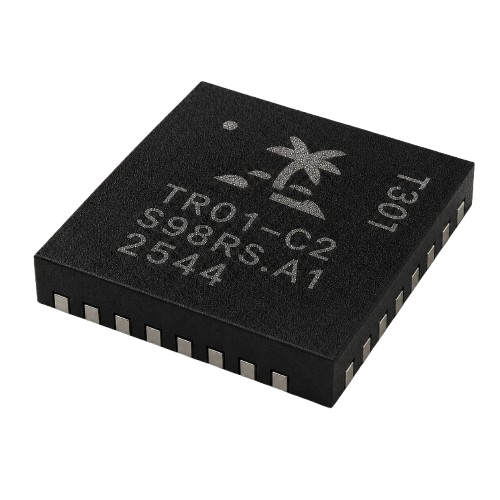

# TROPIC01

**TROPIC01** is an auditable secure element built around a **RISC-V** core and a custom cryptographic coprocessor named **SPECT**.

The hardware RTL, firmware source, and security architecture are open for review and audit. TROPIC01 is currently in production, available to order and integrate!

> [!NOTE]
> Join our community on [Discord](https://discord.gg/Tc3yJmFCnV)!

### Get Started with TROPIC01

- [TROPIC01 Part Numbers](doc/pages/part-numbers.md) - Information for all existing part numbers (Datasheets, APIs, Firmware, Errata and more)
- [Devboards](https://github.com/tropicsquare/devboards) - Repository with hardware resources for our development boards
- [Integration Resources](doc/pages/integration-resources.md) - Official SDK and tutorials for our devboards
- [Security Architecture](doc/application_notes/ODN_TR01_app_008_sec_arch_1v0.pdf) - Application note describing the security architecture of the chip in great detail

### Audit TROPIC01's Open Design

   - [RTL Design](https://github.com/tropicsquare/tropic01-rtl) Hardware design written in SystemVerilog. Functional specification and memory map are available in the `doc/chip_top/` folder
   - [Application Firmware](https://github.com/tropicsquare/ts-tr01-app) Firmware running on TROPIC01's RISC-V CPU
   - [Internal SDK](https://github.com/tropicsquare/ts-tr01-sdk) Internal Software Development Kit used by the RISC-V Application Firmware
   - [SPECT Compiler](https://github.com/tropicsquare/ts-spect-compiler) Compiler and instruction set simulator for the SPECT ECC engine.
   - [SPECT Firmware](https://github.com/tropicsquare/ts-spect-fw) Firmware for the SPECT ECC co-processor

### FAQ

- [FAQ](doc/pages/FAQ.md) - Common questions answered
